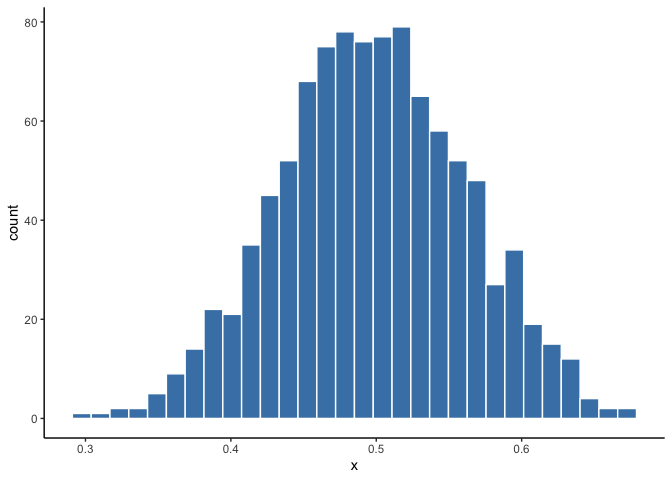
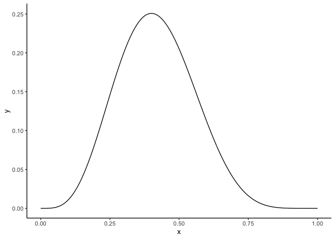
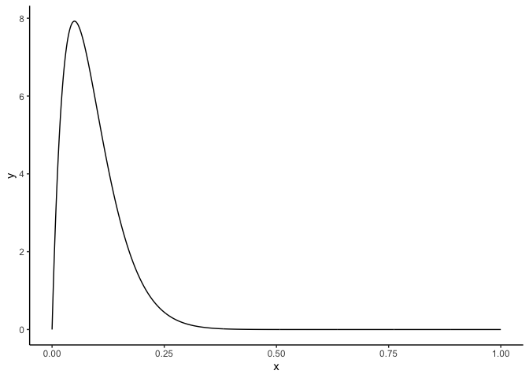
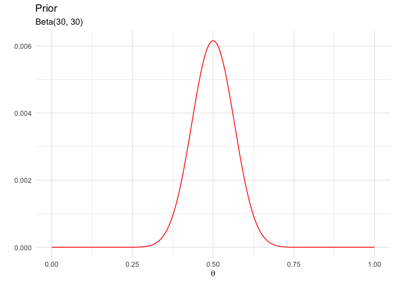
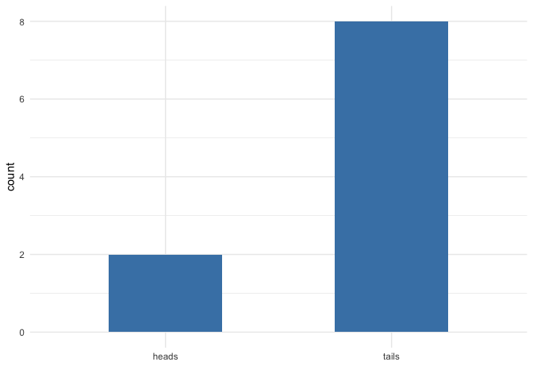
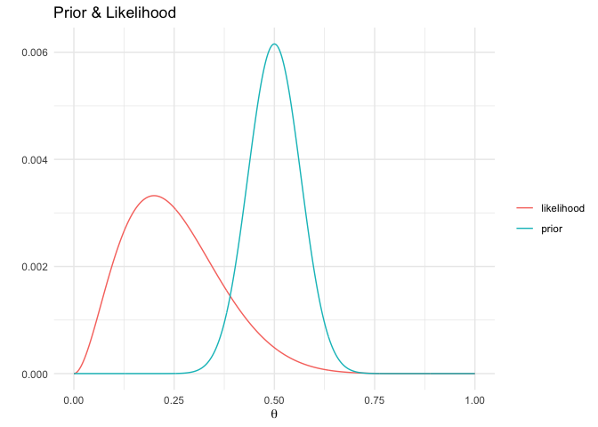

Intro to Bayesian Statistic: Basics and distributions
================
Philipp Masur
2022-09

-   <a href="#basics-of-data-simulation"
    id="toc-basics-of-data-simulation">Basics of data simulation</a>
    -   <a href="#creating-vectors-of-numbers"
        id="toc-creating-vectors-of-numbers">Creating vectors of numbers</a>
    -   <a href="#sampling-from-a-vector"
        id="toc-sampling-from-a-vector">Sampling from a vector</a>
    -   <a href="#replicating-procedures"
        id="toc-replicating-procedures">Replicating procedures</a>
-   <a href="#sampling-from-distributions"
    id="toc-sampling-from-distributions">Sampling from distributions</a>
    -   <a href="#random-generation-of-numbers-drawn-from-a-distribution"
        id="toc-random-generation-of-numbers-drawn-from-a-distribution">Random
        generation of numbers drawn from a distribution</a>
    -   <a href="#density-functions" id="toc-density-functions">Density
        functions</a>
-   <a href="#the-coin-toss-example" id="toc-the-coin-toss-example">The coin
    toss example</a>
    -   <a href="#prior-belief" id="toc-prior-belief">Prior belief</a>
    -   <a href="#likelihood" id="toc-likelihood">Likelihood</a>
    -   <a href="#posterior" id="toc-posterior">Posterior</a>

In this tutorial, we are going to explore some basics of Bayesian
statistics, including exercises to understand what it means to sample
from a distribution, mathematically deriving posterior distributions,
etc. If you are new to Bayesian statistics, consider working through
[these slides]() which introduce the basic concepts and exemplify
Bayesian Analysis based on real-world data.

# Basics of data simulation

## Creating vectors of numbers

``` r
# A vector of 6 values
c(1, 1, 1, 0, 0, 0)
```

    ## [1] 1 1 1 0 0 0

``` r
c(rep(1, 3), rep(0, 3))
```

    ## [1] 1 1 1 0 0 0

``` r
# Consecutive numbers
c(1:10)
```

    ##  [1]  1  2  3  4  5  6  7  8  9 10

## Sampling from a vector

``` r
# Random numbers from a vector
sample(c(1:100), 2)
```

    ## [1] 34 88

## Replicating procedures

``` r
replicate(n = 2, expr = sample(c(1:100), 2))
```

|     |     |
|----:|----:|
|  58 |  15 |
|  73 |   8 |

``` r
replicate(n = 2, expr = sample(c(1:100), 2), simplify = F)
```

    ## [[1]]
    ## [1] 82  7
    ## 
    ## [[2]]
    ## [1] 95  8

``` r
replicate(n = 2, expr = sample(c(1:100), 2)) %>% as.vector
```

    ## [1] 13 38 98 17

# Sampling from distributions

## Random generation of numbers drawn from a distribution

``` r
# Uniform distribution
runif(n = 1, min = 0, max = 10)
```

    ## [1] 0.8947981

``` r
# Normal (gaussian) distribution
rnorm(n = 1, mean = 0, sd = 1)
```

    ## [1] -0.3249891

``` r
rnorm(10, 5, 2)
```

    ##  [1] 1.605325 2.434616 6.460755 5.738208 7.618111 2.030356 3.364434 3.742878
    ##  [9] 5.891349 5.481093

``` r
# Beta distribution
rbeta(10, 1, 1)
```

    ##  [1] 0.5973721 0.4377686 0.1227528 0.8465814 0.9450667 0.3374728 0.3614358
    ##  [8] 0.9339810 0.6575623 0.8343650

``` r
# Binomial distribution
rbinom(n = 1, size = 10, .5)
```

    ## [1] 6

``` r
replicate(10, rbinom(n = 1, size = 10, .5))
```

    ##  [1] 6 5 3 5 2 6 5 6 3 6

**Question:** Produce a beta distribution with n = 1000 that corresponds
to a normal distribution. How would you plot this distribution? (Don’t
forget to load packages that you might need)

``` r
x <- rbeta(1000, 30, 30)

ggplot(NULL, aes(x = x)) +
  geom_histogram(color = "white", fill = "steelblue") +
  theme_classic()
```

<!-- -->

## Density functions

Remember the coin toss? How can we estimate the

``` r
dbinom(x = 4, size = 10, prob = .5)
```

    ## [1] 0.2050781

``` r
x <- seq(0, 1, by = .001)
y <- dbinom(4, 10, x)
ggplot(NULL, aes(x = x, y = y)) +
  geom_line() +
  theme_classic()
```

<!-- -->

**Question:** How could we produce a beta density plot with the shapes

= 2 and

= 20 across probabilities from 0 to 1? How would you plot this?

``` r
x <- seq(0, 1, by = .001)
y <- dbeta(x, 2, 20)
ggplot(NULL, aes(x = x, y = y)) +
  geom_line() +
  theme_classic()
```

<!-- -->

# The coin toss example

## Prior belief

``` r
d <- tibble(prob = seq(0, 1, by = .001),     
            prior = dbeta(prob, 30, 30)) %>%  
  mutate(prior = prior/sum(prior))   # standardization

# Plot
d %>%
  ggplot(aes(x = prob, 
             y = prior)) +
  geom_line(color = "red") +
  theme_minimal() +
  labs(x = expr(theta), 
       y = "", 
       title = "Prior",
       subtitle = "Beta(30, 30)")
```

<!-- -->

## Likelihood

``` r
# Coin toss
set.seed(5)
toss <- sample(c("tails", "heads"), size = 10, replace = T)

# Summary
table(toss)
```

| heads | tails |
|------:|------:|
|     2 |     8 |

``` r
# Frequency Plot
ggplot(NULL, 
       aes(x = toss)) + 
  geom_bar(fill = "steelblue", width = .5) + 
  scale_y_continuous(n.breaks = 5, limits = c(0, 8)) +
  theme_minimal() +
  labs(x = "")
```

<!-- -->

``` r
# Compute likelihood
d <- d %>%
  mutate(likelihood = dbinom(x = 2, size = 10, prob = prob), 
         likelihood = likelihood/sum(likelihood)) 

# Plot
d %>%
  gather(key, value, -prob) %>%
  ggplot(aes(x = prob, y = value, color = key)) +
  geom_line() +
  theme_minimal() +
  labs(x = expr(theta), 
       y = "", 
       color = "",
       title = "Prior & Likelihood")
```

<!-- -->

## Posterior

``` r
d <- d %>%
  mutate(posterior = (prior*likelihood)/sum(prior*likelihood))

d %>%
  gather(key, value, -prob) %>%
  mutate(factor(key, 
         levels = c("prior", "likelihood", "posterior"))) %>%
  ggplot(aes(x = prob, y = value, color = key)) +
  geom_line() +
  scale_color_manual(values = c("darkblue", "black", "red")) +
  theme_minimal() +
  labs(x = expr(theta), y = "", color = "",
       title = "Prior, likelihood & posterior")
```

<!-- -->

**Question:** Let’s practice. Let’s say we roll the dice again. Can we
use our previous posterior as new prior and our new data as new
likelihood? How does the posterior look like? What happens if we toss
the coin 100 times?

Remember, we can computer the posterior beta distribution like so:

 * Binomial(2, 10, \theta)")

")

``` r
set.seed(12)
toss2 <- sample(c("tails", "heads"), size = 100, replace = T)

# Summary
table(toss2)
```

| heads | tails |
|------:|------:|
|    58 |    42 |

``` r
d2 <- tibble(prob = seq(0, 1, by = .001),
             prior = dbeta(prob, 32, 38),
             likelihood = dbinom(58, 100, prob)) %>%
  mutate(prior = prior/sum(prior),
         likelihood = likelihood/sum(likelihood),
         posterior = prior*likelihood/(sum(prior*likelihood)))

d2 %>%
  gather(key, value, -prob) %>%
  mutate(factor(key, 
         levels = c("prior", "likelihood", "posterior"))) %>%
  ggplot(aes(x = prob, y = value, color = key)) +
  geom_line() +
  scale_color_manual(values = c("darkblue", "black", "red")) +
  theme_minimal() +
  labs(x = expr(theta), y = "", color = "",
       title = "Prior, likelihood & posterior")
```

<!-- -->
