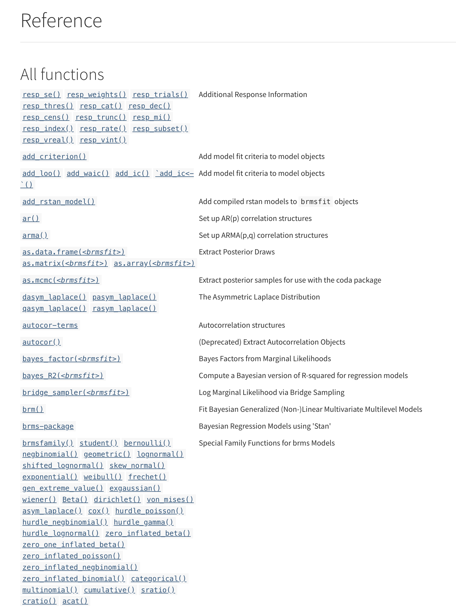

```{r child = 'theme.rmd'}

```

```{css echo=FALSE}
.pull-left2 {
  float: left;
  width: 30%;
}
.pull-right2 {
  float: right;
  width: 60%;
}

.pull-left3 {
  float: left;
  width: 40%;
  padding-right: 5% 
}
.pull-right3 {
  float: right;
  width: 40%;
  padding-left: 5% 
}

.pull-left4 {
  float: left;
  width: 60%;
}
.pull-right4 {
  float: right;
  width: 30%;
}

.my-one-page-font {
  font-size: 17px;
}

.center2 {
  margin: 0;
  position: absolute;
  top: 50%;
  left: 50%;
  -ms-transform: translate(-50%, -50%);
  transform: translate(-50%, -50%);
}

```


.pull-left3[


]

.pull-right3[


]


---

class: inverse, center, middle

# Welcome

Why are you interested in Bayesian Statistics?

Any prior experience?


---

# Expectations and overview

.pull-left[

### What we will cover

- Bayes Theorem 

- Bayesian estimation using Markov Chains Monte Carlo methods

- How to run (generalized) linear models using 'brms'

- How to specify priors and interpret results

- How to draw probabilistic inferences from results (using HDIs, ROPEs, etc.))

]

.pull-left[

### What we will NOT cover

- Introduction to R & Data Wrangling in R

- Introduction to (generalized) linear models

- Bayes factors

- More complex models

]


---

.pull-left[

### Monday

```{r, echo = F}
library(knitr)
tribble(
  ~Time, ~Topic,
  "9:00 - 9:30:" , "Welcome", 
  "9:30 - 10:30:" , "An Introductory Example",  
  "10:30 - 12:00:" , "Basics of Bayesian Statistics",
  "12:00 -  13:00:", "R: Exercise I",
  "13:00 - 14:00:" , "Lunch Break",	
  "14:00 - 14:45:" , "Markov Chain Monte Carlo",
  "14:45 - 15:30:" , "Bayesian Inference vs. NHST", 
  "15:30 - 16:00:" , "Coffee Break",
  "16:00 - 17:00:" , "R: Exercise II"
) %>% kable(format = "markdown")
```

]

.pull-right[

### Tuesday

```{r, echo = F}
tribble(
  ~Time, ~Topic,
  "9:00 - 10:00:" , "Subjective Beliefs and Knowledge Cumulation", 
  "10:00 - 10:30:" , "Short recap of Day 1",  
  "10:30 - 11:30:" , "Simple and Multiple Regression",	
  "11:30 -  13:00:", "R: Exercise III",
  "13:00 - 14:00:" , "Lunch Break",	
  "14:00 - 14:45:" , "Multilevel Regression",	
  "14:45 - 15:30:" , "R: Exercise IV", 
  "15:30 - 16:00:" , "Coffee Break",
  "16:00 - 17:00:" , "Q&A"
) %>% kable(format = "markdown")
```


]

---

# Other things...

- This means a lot of theory, but also practical sessions!

- First day: Understanding Bayesian Statistics

- Second day: Doing stuff in R!

- Please ask questions at all times

- Try to keep up with the theory, but doing stuff in R will be more rewarding!

---

# Literature

.pull-left[

- My slides are based on these books by Kruschke and McElreath...

- ... and their translation to "brms" by Salomon Kurz ([see here](https://bookdown.org/content/3686/))

- Great and comparatively simple introduction

- Lots of examples (including R code)

]

.pull-right[

]

---

# R Packages

.pull-left2[


]

.pull-right2[

- **brms**: Bayesian regression models using Stan

    - Main package
    - All types of models supported
    
- **bayestestR**

    - set of functions to analyze and describe posterior distributions
    - ggplot-based visualizations
    
- **tidybayes**

    - facilitates the use of tidy data with Bayesian models in R
    
- **bayesplot**

    - plotting functions for use after fitting Bayesian models (typically with MCMC)
    - ggplot-based visualizations

]
---

class: inverse, center, middle

# An Introductory Example

"The Geometry of Changing Beliefs"

---

# Example: Covid-19 Rapid Test

.pull-left[

Philipp is generally **a conscientious and orderly** person. Today, he has taken a Corona self-test as he regularly does. To his surprise, the **self-test is positive**. He remembers vaguely that such tests have **a sensitivity of 95%**, i.e. they are very good at picking up the disease. Thinking about it, he actually has been **coughing** a bit lately. He immediately isolates himself and wonders:

<br>

What is the probability of the rapid test result being correct?

]

.pull-right[


]


---

# Intuition?


---

# Reality

- We fail to acknowledge the true prevalence of the disease in the population. 

- Let's imagine for now that it is 4.8% in the population (an infection rate of 4800; currently it is rather 300, thus 0.3%)


---

# New knowledge = observing evidence

- We have observed a positive test result 

- We know that the sensitivity and of such test is 95%: In 95 out of 100 cases, the test correctly identifies an infected person as positive.


---

# What else?

- Such test also have a certain specificity (i.e., ability to correctly identify people who DON'T have the disease), which is also 95%. 

- This means, they produce false positives in 5% of the cases.


---

# What is the true probability?


---

# Non-Bayesian Thinking...


---

# Bayesian Thinking: Updating beliefs


---

# When should we use the Bayes Theorem?


---

# How does this translate into the formula?


---
# How does this translate into the formula?


---
# How does this translate into the formula?


---
# Multiplying probabilities


---

# With actual numbers


---

# The Bayes Theorem


---

# Practical example: Naive Bayes classifier

.pull-left[

- One of the simplest "algorithms" in automated text analysis (supervised machine learning)

- Computes the prior probability ( _P_ ) for every category ( _c_ = outcome variable ) based on the training data set

- Computes the probability of every feature ( _x_ ) to be a characteristic of the class ( _c_ ); i.e., the relative frequency of the feature in category

- For every probability of a category in light of certain features ( _P(c|X)_ ), all feature probabilities ( _x_ ) are multiplied

- The algorithm hence chooses the class that has highest weighted sum of inputs

]

.pull-right[


]

---

# A Short History of Bayesian Statistics

.pull-left[

- Thomas Bayes (1702-1761) was an English mathematician and presbyterian priest who came up with the idea of "inverse probability"

- "An essay towards solving a problem in the doctrine of chances" includes a special cases of the Bayes theorem and was published posthum in 1764 by his friend Richard Price

- Pierre-Simon Laplace (1749-1827) further develops the idea of "inverse probability"

- 1980s: Increase in use of Bayesian statistics due to Markov Chain Monte Carlo methods

]
 

.pull-right[


_(Thomas Bayes)_

]

---

class: inverse, center, middle

# Basics of Bayesian Statistics

"Combining prior beliefs and data"

---

# Basic idea

.pull-left2[

<br>

$prior \rightarrow data \rightarrow posterior$

<br>

$p(\theta) \rightarrow D \rightarrow p(\theta|D)$

<br>


]

--

.pull-right2[

<br><br>

- $\theta$  is the relevant parameter that we are interested in (e.g., a effect, a hypothesis, a model...)

- Bayes Theorem allow us to update a priori assumptions/beliefs  $p(\theta)$  about  $\theta$  based on collected data $D$. 

- The posterior probability  $p(\theta|D)$  reflects the updated assumptions about  $\theta$  given the (newly collected) data

]

---

# What then is probability?

.pull-left[

### Bayesian

A subjective belief

>Bayesian probability statements are thus about states of mind over states of
the world, and not about states of the world per se. Indeed, whatever one
believes about determinism or chance in social processes, the meaningful
uncertainty is that which resides in our brains, upon which we will base decisions
and actions. (Jackman, 2009, S. 7)

]

.pull-right[

### Frequentist

A long-run frequency

>At its core, frequentist statistics is about repeatability and gathering more data. The frequentist interpretation of probability is the long-run frequency of repeatable experiments. For example, saying that the probability of a coin landing heads being 0.5 means that if we were to flip the coin enough times, we would see heads 50% of the time. (Dilipkumar, 2021)

]

---

# Frequentist statistics in short...

.pull-left[

- The "classic" statistical framework

- Is based on the idea of repeated sampling from a population

- Population parameters are fixed, actually exist

- Probability refers to the long-run frequency of a given event

- Data are random, result from sampling a fixed population distribution

]

.pull-right[

```{r, echo = F}
set.seed(42)
pop <- round(rbeta(30000,2,8)*1400+400) 
STP <- sample(pop, 50)
STP.mean <- mean(STP)
STP.sd <- sd(STP)
ggplot(NULL, aes(x = pop)) + geom_histogram(color = "white", fill = "lightblue") +
  geom_vline(xintercept = mean(pop), color = "black", linetype = "dashed") +
  theme_minimal() +
  labs(x = paste0("Income in EUR", " (M = ", round(mean(pop)), ")"),
       title = "Income distribution of students at the JGU")
```

]

---

# Sampling from the population

```{r, echo = F, fig.height=6, fig.width = 15}
sample1000 <- replicate(1000, (sample(pop, 50)))
sample1000.mean <- apply(sample1000, 2, mean)
sample1000.sd <- apply(sample1000, 2, sd)
data.frame(sample1000[, 1:20]) %>%
  gather(key, value) %>%
  mutate(facet =  rep(1:20, each = 50),
         mean = rep(sample1000.mean[1:20], each = 50)) %>%
  as_tibble %>%
  ggplot() + 
  geom_histogram(aes(value), fill = "lightblue", color = "white", 
                 binwidth=50) + 
  geom_vline(aes(xintercept = mean), 
             color = "red") + 
  labs(title = "Income distribution of the first 20 samples (n = 50)", 
       x = "Income in EUR", 
       y = "count") + 
  xlim(400, 1600) + 
  facet_wrap(~ facet) +
  theme_minimal() 
```


---

# Parameter distribution

.pull-left[

```{r, echo = F}
ggplot(data.frame(sample1000.mean)) + 
  geom_histogram(aes(sample1000.mean), fill = "lightblue", color = "white", 
                 binwidth=10) + 
  geom_vline(xintercept = mean(pop), 
             color = "black", linetype = "dashed") + 
  labs(title = "Means of 1000 samples with n = 50", 
       y = "Count", 
       x = paste0('Income (M = ',
                  round(mean(pop), 0),
                  ', SD = ',
                  round(sd(sample1000.mean),1),
                  ')')) +
  theme_minimal()
```

]

.pull-right[


- According to the central limit theorem, the means are distributed around the true population parameter $M$ = `r round(mean(pop))`. 

- The standard error, defined as $SE = SD(x)/\sqrt(n-1)$ and which we can computed based on a single sample, is an estimate for the variance of this mean distribution

- In our first sample, the standard error is $SE$ = $164/\sqrt(50-1)$ = `r round(STP.sd/sqrt(49),1)`
]

---

# What is the p-value then?

.pull-left[

- The p-value tells you how often you would expect to see a test statistic as extreme or more extreme than the one calculated by your statistical test if the null hypothesis of that test was true


- We thus investigate the plausibility of the data given $H_0$, but NOT the plausibility of the hypothesis given the data!

]

.pull-right[


]


---

# (Critique of the) Frequentist approach

- Null hypothesis significance tests (NHST) focuses on the wrong probability:

    - $P(D|H_0)$ instead of $P(H|D)$
<br>
    - Comparatively difficult (and thus often wrong) interpretation of the parameters of interest (p-values, confidence intervals)

- No accumulation of knowledge in the statistical model (i.e., no incorporation of prior information)

- The concept of Frequentist probability can only be applied to standardized, repeatable phenomena

---

# Conceptual Framework of Bayesian Data Analysis

.pull-left2[

<br>

$prior \rightarrow data \rightarrow posterior$

<br>

$p(\theta) \rightarrow D \rightarrow p(\theta|D)$

<br>


]


.pull-right2[

<br>

> Bayesian data analysis has two foundational ideas. The first idea is that Bayesian inference is *reallocation of credibility* across possibilities. The second foundational idea is that the possibilities, over which we allocate credibility, are *parameter values in meaningful mathematical models*. (Kruschke, 2015, p. 15)

]


---

# Reallocation of probability: The classical coin toss


.pull-left[

- We are going to use the classical coin toss example to exemplify the interaction between "prior" belief, data, and "posterior" belief. 

- In Bayesian statistics, parameters of interest (such as the probability of heads) are treated as random variables, which can be described with a probability distribution (e.g., via $Beta(\alpha, \beta)$)


]

.pull-right[


]

---

# The coin toss: Prior Assumptions


.pull-left[

- We don't even need data to describe this distribution, the probability is simply our degree of belief. 

- In this case, we could assume that a fair coin has a high probability of showing heads 50% of the time and a lesser probability to show heads or tails more often.


```{r coin1, eval = F}
# Computing a prior
d1 <- tibble(prob = seq(0, 1, by = .001),     
            prior = dbeta(prob, 30, 30)) %>%  
  mutate(prior = prior/sum(prior))

# Plot
d1 %>%
  ggplot(aes(x = prob, 
             y = prior)) +
  geom_line(color = "red", size = 1.25) +
  theme_minimal() +
  #theme(panel.grid = element_blank()) +
  labs(x = expr(theta), 
       y = "", 
       title = "Prior",
       subtitle = "Beta(30, 30)")
```


]

.pull-right[

```{r coin-out1, ref.label="coin1", echo=FALSE}


```

]

---

# The coin toss: Understanding the data

.pull-left[

- We toss a coin and are interested in the probability of it showing "heads" (vs. "tails"). Let's imagine we toss it 10 times and heads comes up 4 times. 

- Here, we denote y = 1 for "heads" (or success) and y = 0 for "tails" (failure).


```{r, coin2, eval = F}
# Coin toss
set.seed(1)
toss <- sample(c("tails", "heads"), size = 10, replace = T)

# Frequency Plot
ggplot(NULL, 
       aes(x = toss)) + 
  geom_bar(fill = "steelblue", width = .5) + 
  scale_y_continuous(n.breaks = 5, limits = c(0, 8)) +
  theme_minimal() +
  labs(x = "")
```

]

.pull-right[

```{r coin-out2, ref.label="coin2", echo=FALSE}


```

]

---

# The coin toss: The likelihood

.pull-left[

- The likelihood is a mathematical formula that specifies the plausibility of the data

- In our example, the likelihood can be expressed as a binomial distribution:

<br>

$P(y|n, p) = \frac{n!}{y!(n-y)!}p^y(1-p)^{n-y}$

$P(4|10, 0.5) = \frac{10!}{4!(10-4)!}0.5^4(1-0.5)^{10-4} = 0.2050781$


]

.pull-right[

```{r}
dbinom(x = 4, size = 10, prob = 0.5)
dbinom(x = 4, size = 10, prob = c(.25, .5, .75))
```

]

---

# The coin toss: The likelihood

.pull-left[

```{r coin3, eval = F}
# Compute likelihood
d1 <- d1 %>%
  mutate(likelihood = dbinom(x = 4, size = 10, prob = prob), 
         likelihood = likelihood/sum(likelihood))    

# Plot
d1 %>%
  ggplot(aes(x = prob, y = likelihood)) +
  geom_line(color = "darkblue", size = 1.25) +
  theme_minimal() +
  labs(x = expr(theta), y = "", 
       title = "Likelihood",
       subtitle = expr(paste("Binomial(4, 10, ", theta, ")")))
```

]

.pull-right[

```{r coin-out3, ref.label="coin3", echo=FALSE}


```
]

---

# The coin toss: Computing the posterior distribution


$Posterior = Prior * Likelihood$

$P(\theta|y) = P(\theta)*P(y|\theta)$

$P(\theta|y) = Beta(\alpha, \beta) * Binomial(y, n, \theta)$

$P(\theta|y) = Beta(y + \alpha, n - y + \beta)$

$P(\theta|y) = Beta(4 + 30, 10 - 4 + 30)$

--

<br>

**Note:** This works because beta and binomial distribution are from the same family of distributions. The beta distribution is what we call a "conjugate" prior to the binomial distribution!


---

# The coin toss: Computing the posterior distribution


.pull-left[


```{r coin4, eval = F}
d1 <- d1 %>%
  mutate(posterior = (prior*likelihood)/sum(prior*likelihood))

d1 %>%
  gather(key, value, -prob) %>%
  mutate(factor(key, 
         levels = c("prior", "likelihood", "posterior"))) %>%
  ggplot(aes(x = prob, y = value, color = key)) +
  geom_line(size = 1.25) +
  scale_color_manual(values = c("darkblue", "black", "red")) +
  theme_minimal() +
  labs(x = expr(theta), y = "", color = "",
       title = "Prior, likelihood, and posterior") +
  theme(legend.position = "bottom")
```

]

.pull-right[

```{r coin-out4, ref.label="coin4", echo=FALSE}


```
]

---

# Influence of prior on posterior

.pull-left2[

- One of the benefits of Bayesian statistics is that we can use different priors and compare results

- Differently *informative* priors have a differently strong influence on the posterior distribution. 

]

.pull-right2[
```{r, echo = F, fig.height = 5, fig.width = 7.5}
d2 <- tibble(prob = seq(0, 1, length.out = 1000), 
             prior1 = dbeta(prob, 1, 1),
             prior2 = dbeta(prob, 1.5, 1.5),
             prior3 = dbeta(prob, 20, 20),
             prior4 = rep(0:1, each = 1000 / 2),
             prior5 = exp(-abs(prob - .55) / .25) / ( 2 * .25),
             likelihood = dbinom(x = 4, size = 10, prob = prob)) %>%
  gather(key, value, -prob, -likelihood) %>%
  group_by(key) %>%
  mutate(value = value/sum(value),
         likelihood = likelihood/sum(likelihood),
         posterior = value*likelihood/sum(value*likelihood)) %>%
  separate(key, c("var", "type"), sep = 5) %>%
  spread(var, value)

d2 %>%
  gather(key, value, -prob, -type) %>%
  mutate(key = factor(key, levels = c("prior", "likelihood", "posterior"))) %>%
  ggplot(aes(x = prob, y = value, color = key)) +
  geom_line() +
  facet_grid(type~key) +
  scale_color_manual(values = c("red", "darkblue", "black")) +
  theme_tidybayes() +
  theme(legend.position = "none") +
  labs(x = expr(theta), y = "",  color = "",
       title = "Influence of different prior distributions")
```

]


---

# Influence of sample size 

.pull-left2[

- When we collect larger samples, the influence of the prior will be overwhelmed by the data

- Our estimation naturally thereby becomes more precise

]

.pull-right2[

```{r, echo = F, fig.height = 5, fig.width = 7.5}
d2 <- tibble(prob = seq(0, 1, length.out = 1000), 
             prior = dbeta(prob, 20, 20),
             likelihood10 = dbinom(x = 4, size = 10, prob = prob),
             likelihood100 = dbinom(x = 40, size = 100, prob = prob),
             likelihood1000 = dbinom(x = 80, size = 200, prob = prob)) %>%
  gather(key, value, -prob, -prior) %>%
  group_by(key) %>%
  mutate(value = value/sum(value),
         prior = prior/sum(prior),
         posterior = prior*value/sum(prior*value)) %>%
  separate(key, c("var", "type"), sep = 10) %>%
  spread(var, value) %>%
  mutate(type = paste("n = ", type))

d2 %>%
  gather(key, value, -prob, -type) %>%
  mutate(key = factor(key, levels = c("prior", "likelihood", "posterior"))) %>%
  ggplot(aes(x = prob, y = value, color = key)) +
  geom_line() +
  facet_grid(type~key) +
  scale_color_manual(values = c("red", "darkblue", "black")) +
  theme_tidybayes() +
  theme(legend.position = "none") +
  labs(x = expr(theta), y = "", 
       title = "Influence of different prior distributions")
```

]

---

# What to do with the posterior distribution?

.pull-left[

- Well, we can summarize it much like any distribution and thereby gain an understanding of our updated probability

    - The most frequent $\theta$ value is the most probably value in the distribution
    
    - We could define boundaries for the most probable values
    
    - and many more things (more on that later)

]

.pull-right[
    
```{r, echo = F}
p1 <- d1 %>% 
  ggplot(aes(x = prob)) +
  geom_line(aes(y = posterior)) +
  geom_ribbon(data = d1 %>% filter(prob > .5),
              aes(ymin = 0, ymax = posterior), fill = "darkred") +
  labs(x = "probabilities of the coin being biased toward heads",
       y = "density") +
  theme_minimal()

p2 <- d1 %>% 
  ggplot(aes(x = prob)) +
  geom_line(aes(y = posterior)) +
  geom_ribbon(data = d1 %>% filter(prob < .5),
              aes(ymin = 0, ymax = posterior), fill = "steelblue") +
  labs(x = "probabilities of the coin being biased toward tails",
       y = "density") +
  theme_minimal()

cowplot::plot_grid(p1, p2, nrow = 2)
```

]

---

# Summarizing the Logic of Bayesian Inference


- Bayesian inference is reallocation of credibility across possibilities

- The distribution of credibility initially reflects prior knowledge about the possibilities (which can be quite vague or very specific)

- When new data are observed, the credibility is re-allocated

- Possibilities that are consistent with the data garner more credibility, while possibilities that are not consistent with the data lose credibility: we can hence test several prior beliefs

- Bayesian analysis is the mathematics of re-allocating credibility in a logically coherent and precise way

---

# Analytic challenges: Why can't we do it always like that?

- Many research application are not analytically solvable

- For example, when we investigate continuous data, the denominator in the Bayes Theorem is often not analytically solvable:


$P(\theta|y) = \frac{p(y|\theta)P(\theta)}{P(y)} = \frac{L(\theta,y)P(\theta)}{\int P(y|\theta)P(\theta)d\theta}$

- Different solutions exits:
    - Conjugate priors (what we just did in the coin example, not very flexible)
    - Numeric grid approximation of the integral (doesn't work if the model has many parameters)
    - **Markov Chain Monte Carlo Methods**

---

class: inverse, center, middle

# Markov Chain Monte Carlo

"Simulating caterpillars"

---

# Basic Idea

- Whenever we cannot produce a posterior distribution analytically, we can **approximate** its form using a method called Markov Chains Monte Carlo (MCMC)

- Approximation means that an algorithm produces a large number of $\theta$ values from the posterior distribution (i.e., actual data that looks like the posterior distribution!)

- This heap of representative $\theta$ values can then be used to estimate the central tendency of the posterior, highest density intervals (HDI) and many more things

- Bayesian, simulation-based inference is thus based on the repeated sampling from the posterior distribution

- The posterior is hence produced by randomly generating a lot of values from it.

---

# Approximating a distribution with a (large) sample

.pull-left[

- The basic idea should be well know: e.g., when we sample a subset of people from a population to estimate underlying tendencies in the population

- Here, we sample from a mathematically defined distribution (e.g., the posterior probability distribution)

- Naturally, the larger the sample, the smoother the resulting histogram and the closer the sample is to the exact distribution

]

.pull-right[

```{r, echo = F}
hdi_of_icdf <- function(name, width = .95, tol = 1e-8, ... ) {
  
  incredible_mass <- 1.0 - width
  interval_width <- function(low_tail_prob, name, width, ...) {
    name(width + low_tail_prob, ...) - name(low_tail_prob, ...)
  }
  opt_info <- optimize(interval_width, c(0, incredible_mass), 
                       name = name, width = width, 
                       tol = tol, ...)
  hdi_lower_tail_prob <- opt_info$minimum
  return(c(name(hdi_lower_tail_prob, ...),
           name(width + hdi_lower_tail_prob, ...)))
  
}

h <-
  hdi_of_icdf(name = qbeta,
              shape1 = 15,
              shape2 = 7)

omega <- (15 - 1) / (15 + 7 - 2)

tibble(theta = seq(from = 0, to = 1, length.out = 1000)) %>% 
  mutate(density = dbeta(theta, shape1 = 15, shape2 = 7)) %>% 
  
  ggplot() +
  geom_area(aes(x = theta, y = density),
            fill = "steelblue") +
  geom_segment(aes(x = h[1], xend = h[2], y = 0, yend = 0),
               size = 2) +
  geom_point(aes(x = omega, y = 0),
             size = 4, shape = 19, color = "black") +
  
  
  scale_x_continuous(expression(theta), 
                     breaks = c(0, h, omega, 1),
                     labels = c("0", h %>% round(2), omega, "1")) +
  ggtitle("Exact distribution") +
  ylab(expression(p(theta))) +
  labs(subtitle = "Beta(15,7)") +
  theme_tidybayes()
```

]

---

# Sampling from the distribution 


```{r, echo = F, fig.width = 10, fig.height = 4}
set.seed(7)
d <- tibble(n = c(500, 5000, 50000)) %>% 
  mutate(theta = map(n, ~rbeta(., shape1 = 15, shape2 = 7))) %>% 
  unnest(theta) %>% 
  mutate(key = str_c("Sample N = ", n))

d %>% 
  ggplot(aes(x = theta, y = 0)) +
  stat_histinterval(point_interval = mode_hdi, .width = .95, 
                    breaks = 30, fill = "steelblue") +
  scale_x_continuous(expression(theta), limits = c(0, 1)) +
  scale_y_continuous(NULL, breaks = NULL) +
  facet_wrap(~ key, ncol = 3, scales = "free") +
  theme_tidybayes()
```

---

# Example

```{r, echo = F, fig.width = 12, fig.height = 1.5}
set.seed(42)
r <- 1:100
t <- replicate(rbeta(1, 14, 7), n = 100)

p1 <- ggplot(NULL, aes(x = r[1], y = t[1])) +
  geom_point(color = "steelblue", shape = 1) +
  geom_line(color = "steelblue") +
  labs(x = "Sampling steps") +
  ylim(0, 1) +
  scale_x_continuous(limits = c(1, 100)) +
  theme_classic()
p2 <- ggplot(NULL, aes(x = t[1])) +
  geom_histogram(color = "white", fill = "steelblue" ) +
  xlim(0, 1) +
  coord_flip() +
  labs(x = "") +
  theme_classic()

cowplot::plot_grid(p1, p2, rel_widths = c(4, 1))
```


```{r}
set.seed(42)
t <- replicate(rbeta(1, 14, 7), n = 100)
t[1]
```

---
# Example

```{r, echo = F, fig.width = 12, fig.height = 1.5}
p1 <- ggplot(NULL, aes(x = r[1:2], y = t[1:2])) +
  geom_point(color = "steelblue", shape = 1) +
  geom_line(color = "steelblue") +
  labs(x = "Sampling steps") +
  ylim(0, 1) +
  scale_x_continuous(limits = c(1, 100)) +
  theme_classic()
p2 <- ggplot(NULL, aes(x = t[1:2])) +
  geom_histogram(color = "white", fill = "steelblue" ) +
  xlim(0, 1) +
  coord_flip() +
  labs(x = "") +
  theme_classic()

cowplot::plot_grid(p1, p2, rel_widths = c(4, 1))
```

```{r}
t[1:2]
```


---

# Example

```{r, echo = F, fig.width = 12, fig.height = 1.5}
p1 <- ggplot(NULL, aes(x = r[1:4], y = t[1:4])) +
  geom_point(color = "steelblue", shape = 1) +
  geom_line(color = "steelblue") +
  labs(x = "Sampling steps") +
  ylim(0, 1) +
  scale_x_continuous(limits = c(1, 100)) +
  theme_classic()
p2 <- ggplot(NULL, aes(x = t[1:4])) +
  geom_histogram(color = "white", fill = "steelblue" ) +
  xlim(0, 1) +
  coord_flip() +
  labs(x = "") +
  theme_classic()

cowplot::plot_grid(p1, p2, rel_widths = c(4, 1))
```

```{r}
t[1:4]
```

---
# Example

```{r, echo = F, fig.width = 12, fig.height = 1.5}
p1 <- ggplot(NULL, aes(x = r[1:10], y = t[1:10])) +
  geom_point(color = "steelblue", shape = 1) +
  geom_line(color = "steelblue") +
  labs(x = "Sampling steps") +
  ylim(0, 1) +
  scale_x_continuous(limits = c(1, 100)) +
  theme_classic()
p2 <- ggplot(NULL, aes(x = t[1:10])) +
  geom_histogram(color = "white", fill = "steelblue" ) +
  xlim(0, 1) +
  coord_flip() +
  labs(x = "") +
  theme_classic()

cowplot::plot_grid(p1, p2, rel_widths = c(4, 1))
```

```{r}
t[1:10]
```


---
# Example

```{r, echo = F, fig.width = 12, fig.height = 1.5}
p1 <- ggplot(NULL, aes(x = r[1:25], y = t[1:25])) +
  geom_point(color = "steelblue", shape = 1) +
  geom_line(color = "steelblue") +
  labs(x = "Sampling steps") +
  ylim(0, 1) +
  scale_x_continuous(limits = c(1, 100)) +
  theme_classic()
p2 <- ggplot(NULL, aes(x = t[1:25])) +
  geom_histogram(color = "white", fill = "steelblue" ) +
  xlim(0, 1) +
  coord_flip() +
  labs(x = "") +
  theme_classic()

cowplot::plot_grid(p1, p2, rel_widths = c(4, 1))
```

```{r}
t[1:25]
```

---

# Example

```{r, echo = F, fig.width = 12, fig.height = 1.5}
p1 <- ggplot(NULL, aes(x = r[1:50], y = t[1:50])) +
  geom_point(color = "steelblue", shape = 1) +
  geom_line(color = "steelblue") +
  labs(x = "Sampling steps") +
  ylim(0, 1) +
  scale_x_continuous(limits = c(1, 100)) +
  theme_classic()
p2 <- ggplot(NULL, aes(x = t[1:50])) +
  geom_histogram(color = "white", fill = "steelblue" ) +
  xlim(0, 1) +
  coord_flip() +
  labs(x = "") +
  theme_classic()

cowplot::plot_grid(p1, p2, rel_widths = c(4, 1))
```

```{r}
t[1:50]
```

---

# Example

```{r, echo = F, fig.width = 12, fig.height = 1.5}
p1 <- ggplot(NULL, aes(x = r[1:100], y = t[1:100])) +
  geom_point(color = "steelblue", shape = 1) +
  geom_line(color = "steelblue") +
  labs(x = "Sampling steps") +
  ylim(0, 1) +
  scale_x_continuous(limits = c(1, 100)) +
  theme_classic()
p2 <- ggplot(NULL, aes(x = t[1:100])) +
  geom_histogram(color = "white", fill = "steelblue" ) +
  xlim(0, 1) +
  coord_flip() +
  labs(x = "") +
  theme_classic()

cowplot::plot_grid(p1, p2, rel_widths = c(4, 1))
```

```{r}
t[1:100]
```
---

# Example

```{r, echo = F, fig.width = 12, fig.height = 1.5}
r = 1:5000
t1 <- replicate(rbeta(1, 14, 7), n = 5000)

p1 <- ggplot(NULL, aes(x = r, y = t1[1:5000])) +
  geom_point(color = "steelblue", shape = 1) +
  geom_line(color = "steelblue") +
  labs(x = "Sampling steps") +
  ylim(0, 1) +
  theme_classic()
p2 <- ggplot(NULL, aes(x = t1)) +
  geom_histogram(color = "white", fill = "steelblue" ) +
  xlim(0, 1) +
  coord_flip() +
  labs(x = "") +
  theme_classic()

cowplot::plot_grid(p1, p2, rel_widths = c(4, 1))
```

--

```{r, echo = F, fig.width = 12, fig.height = 1.5}

t2 <- replicate(rbeta(1, 14, 7), n = 5000)
p1 <- data.frame(r, t1, t2) %>%
  gather(key, value, -r) %>%
  ggplot(aes(x = r, y = value, color = key)) +
  geom_line() +
  labs(x = "Sampling steps", y = "probability") +
  ylim(0, 1) +
  scale_color_manual(values = c("darkred", "steelblue")) +
  theme_classic() +
  theme(legend.position = "none")

p2 <- data.frame(r, t1, t2) %>%
  gather(key, value, -r) %>%
  ggplot(aes(x = value, group = key, color = key, fill = key)) +
  geom_density(alpha = .6) +
  xlim(0, 1) +
  coord_flip() +
  labs(x = "") +
  scale_color_manual(values = c("darkred", "steelblue")) +
  scale_fill_manual(values = c("darkred", "steelblue")) +
  theme_classic() +
  theme(legend.position = "none")

cowplot::plot_grid(p1, p2, rel_widths = c(4, 1))
```


- Even when we resample from the same distribution, in the long-run, the data will converge towards the target distribution

- Here, we can already see one approach to "check" whether the chains have converged: If they form caterpillar plots like the one at the bottom, and the two chains overlap significantly, they both have converged perfectly. 

---

# Markov Chain Monte Carlo

- Markov chain Monte Carlo (MCMC) methods work in a similar type of way

- They comprise a class of algorithms for sampling from a probability distribution

- By constructing a Markov chain that has the desired distribution as its equilibrium distribution, one can obtain a sample of the desired distribution by recording states from the chain. 

- The more steps that are included, the more closely the distribution of the sample matches the actual desired distribution. 

- Various algorithms exist for constructing chains exist:

    - Metropolis Algorithm
    - Metropolis–Hastings algorithm
    - Gibbs Sampling
    - Hamiltonian Monte Carlo (implemented in `brms`)
    - No-U-Turn Sampler (NUTS, also implemented in `brms`)


---

# A Simple Metropolis Algorithm (see McElreath, chapter 7.2)

.pull-left[

- King Markov is a benevolent autocrat of an island kingdom 

- The king’s island kingdom is displayed in the Figure on the right, with the islands numbered by their relative population sizes

- He wants to visit each island in His kingdom from time to time.

- Everyone agreed that the king should visit each island in proportion to its population size, visiting the largest island 10 times as often as the smallest, for example.

- The Good King Markov wanted a way to fulfill his obligation without planning his travels months ahead of time and further insisted that he only move among adjacent islands, to minimize time spent on the water (sea monsters, etc.)

]


.pull-right[


]

---

# Theory of the travel computation

His advisor engineered a clever solution to these demands and here's how it works:

1. Wherever the King is, each week he decides between staying put for another week or moving to one of the two adjacent islands. To decide his next move, he **flips a coin**.

2. If the coin turns up heads, the King considers moving to the adjacent island clockwise around the archipelago. If the coin turns up tails, he considers instead moving counterclockwise. Call the island the coin nominates **the proposal** island. 

3. Now, to see whether or not he moves to the proposal island, King Markov counts out **a number of seashells** equal to the relative population size of the proposal island. So for example, if the proposal island is number 9, then he counts out 9 seashells. Then he also counts out **a number of stones** equal to the relative population of the current island. So for example, if the current island is number 10, then King Markov ends up holding 10 stones, in addition to the 9 seashells.

4. When there are **more seashells than stones**, King Markov always moves to the proposal island. But if there are fewer shells than stones, he discards a number of stones equal to the number of shells. So for example, if there are 4 shells and 6 stones, he ends up with 4 shells and 6 - 4 = 2 stones. Then he places the shells and the remaining stones in a bag. He reaches in and **randomly pulls out one object**. If it is a shell, he moves to the proposal island. Otherwise, he stays put another week. As a result, the probability that he moves is equal to the number of shells divided by the original number of stones.

---

# Computation of King Markov's travel route

.pull-left[

```{r}
set.seed(7)
num_days  <- 5e4
positions <- rep(0, num_days)
current   <- 4
for (i in 1:num_days) {
  
  # record current position
  positions[i] <- current
  
  # flip coin to generate proposal
  proposal <- current + sample(c(-1, 1), size = 1)
  
  # now make sure he loops around from 7 back to 1
  if (proposal < 1) proposal <- 7
  if (proposal > 7) proposal <- 1
  
  # move?
  prob_accept_the_proposal <- proposal/current
  current <- ifelse(runif(1) < prob_accept_the_proposal, 
                    proposal, 
                    current)
}
```


]

.pull-right[

```{r, echo = F}
tibble(t = 1:5e4,
       theta = positions) %>% 
  slice(1:500) %>% 
  ggplot(aes(x = theta, y = t)) +
  geom_path(size = 1/2, color = "steelblue") +
  geom_point(size = 1, alpha = .8, color = "steelblue") +
  scale_x_continuous(expression(theta), breaks = 1:7) +
  scale_y_log10("Time Step", breaks = c(1, 2, 5, 20, 100, 500)) +
  theme_tidybayes()
```

]

---
# Resulting distribution of time on each island


.pull-left[
```{r, echo = F}
tibble(t = 1:5e4,
       island = positions)%>%
  mutate(island = factor(island)) %>%
  ggplot(aes(x = island)) +
  geom_bar(fill = "steelblue") +
  theme_tidybayes()
```

]

.pull-right[

- Even though the King seems to move randomly across the archipel, in the end, he visits each island proportional to its population size

- This is of course a fictitious, somewhat artificial example, but it shows that the algorithm works

- Drawing from a posterior distribution is - to a certain degree (slightly more complex) similar to such a random walk

]

---

# Preliminary summary on MCMC

- Whenever we cannot solve the denominator of the Bayes Theorem analytically, we resort to MCMC methods to approximate the posterior distribution

- The result of a Bayesian analysis is thus almost always a number of $\theta$ values whose distribution is representative of the posterior distribution

- This posterior can then be analyzed and used for inferences

- Because it is an actual data set with certain properties, the possibilities for different types of inferences are practically endless


--

<br>

**Note:** An important step in Bayesian simulation-based inference is to check whether the MCMC chains actually "converged". We will come back to MCMC diagnostics later as those can be best understood based on an actual proper example!

---

class: inverse, center, middle

# Bayesian Inference vs. NHST

"Summarizing the posterior"

---

# Applying Bayes to linear regression

<br><br>

**Frequentist:** There is a single "true" line of best fit, and I'll give my best estimate of it.

<br>

**Bayesian:** There is a distribution of lines of fit, some more plausible than others, and I'll give you samples from that distribution.


---

# Proper (Communication) Example

- In 2019, I conducted an experiment in which participants saw different social media feeds (Masur, DiFranzo & Bazarova, 2021). The feeds varied with regard to the amount of visual disclosure in a) posts (norm) and b) profile pictures (profile). 

- Afterwards, participants were asked to indicate their perception of the norm to disclose the self and how likely they would be to disclose themselves on such a social media platform.

- In a first step, let's have a look at the relationship between perceptions and behaviors

---

# Getting to know the data

.pull-left[

```{r}
url <- "https://osf.io/kfm6x/download"
d <- read.csv(url,header=TRUE, na.strings="NA") %>%
  as_tibble %>% 
  select(norm, profile, 
         contains("NOR"), 
         contains("BEH"))
(d %<>% mutate(id = 1:n(),
         perceptions = rowMeans(
           d %>% select(contains("NOR"), -norm)
         ),
         behavior = rowMeans(
           d %>% select(contains("BEH"))
         )) %>%
  select(norm, profile, perceptions, behavior))
```

]

.pull-right[

```{r, echo = F}
d %>%
  select(perceptions, behavior) %>%
  gather(key, value) %>%
  ggplot(aes(x = value, fill = key)) +
  geom_histogram(color = "white") +
  facet_wrap(~key) +
  theme_tidybayes() +
  theme(panel.grid = element_blank(),
        legend.position = "none") +
  labs(x = "Likert-type scale from 1 to 7")
```

]
---

# Standardization

- As in frequentist linear regression analysis, it can be meaningful to standardize our variables upfront

- Although standardization is not obligatory, it is often very meaningful in Bayesian analyses because

    - algorithms converge more easily with smaller data ranges
    - we often can quantify our prior beliefs better on a standardized scale (e.g., $r = .10$)


```{r, R.options=list(width = 120)}
d$perceptions_std = scale(d$perceptions) %>% as.vector
d$behavior_std = scale(d$behavior) %>% as.vector

d %>%
  select(perceptions_std, behavior_std) %>%
  psych::describe()
```

---

# Frequentist linear regression


.pull-left2[

We can define this model with the following formula:

$y_i = \beta_0 + \beta_1x_i + \epsilon_i$

or alternatively as:

$y_i \sim Normal(\mu_i, \sigma)$

$\mu_i = \beta_0 + \beta_1x_i$

]


.pull-right2[


```{r}
m_freq <- lm(behavior_std ~ perceptions_std, 
             data = d[1:100,])
summary(m_freq)
```


]

---

# Visualization


.pull-left[

```{r ex1, eval = F}
(p_freq <- ggplot(d[1:100,], 
                  aes(x = perceptions_std, 
                      y = behavior_std)) +
  geom_point(alpha = .5, size = 2) +
  geom_smooth(method = "lm", color = "steelblue", ) +
  theme_classic() +
  labs(title = "One line equals the best fit", 
       subtitle = "Frequentist Estimation", 
       x = "Norm Perceptions",
       y = "Self-Disclosure"))
```

]

.pull-right[

```{r ex1-out, ref.label="ex1", echo=FALSE}

```

]

---

# Bayesian Linear regression

.pull-left2[

This model can be expressed with the following formula

*Likelihood:*

$y_i \sim Normal(\mu_i, \sigma)$

$\mu_i = \beta_0 + \beta_1x_i$

*Prior (weakly informative)*:

$\beta_0 \sim Normal(0, 10)$

$\beta_1 \sim Normal(0, 10)$

$\sigma \sim Uniform(0, 10)$


]

.pull-right2[

```{r, echo = F, message = F, warning = F}
library(brms)
#m_bay <- brm(formula = behavior_std ~ 1 + perceptions_std, data = d[1:100,], seed = 2)
#save(m_bay, file = "slides/material/results/m_bay.RData")
load("material/results/m_bay.RData")
```

```{r, eval = F}
m_bay <- brm(formula = behavior_std ~ 1 + perceptions_std, 
             data = d[1:100,], 
             seed = 2)
```

```{r}
summary(m_bay)
```

]

---

# Visualization

.pull-left[

```{r ex2, eval = F}
# Extract posterior distributions
draws <- as_draws_df(m_bay)

# Plot regression lines
(p_bay <- draws %>% 
  sample_n(size = 200) %>%
  ggplot() +
  geom_abline(aes(intercept = b_Intercept, 
                  slope = b_perceptions_std, 
                  group = .draw),
              color = "grey50", size = 1/4, alpha = .3) +
  geom_abline(aes(intercept = -0.0534, 
                  slope = 0.394, 
                  group = .draw),
              color = "steelblue", size = 1) +
  geom_point(data = d[1:100,],
             aes(x = perceptions_std, y = behavior_std),
             size = 2, alpha = .5) +
  labs(title = "Multiple credible regression lines",
       subtitle = "Bayesian Estimation",
       x = "Norm Perceptions",
       y = "Self-Disclosure") +
  theme_classic())
```

]

.pull-right[

```{r ex2-out, ref.label="ex2", echo=FALSE}

```

]

---

# Visualization: Many possibilities!


```{r, echo = F, fig.height = 6, fig.width = 15}
# Plot regression lines
size100 <- draws %>% 
  sample_n(size = 100) %>%
  mutate(sample = 100)
size500 <- draws %>% 
  sample_n(size = 500) %>%
  mutate(sample = 500)
size2000 <- draws %>% 
  sample_n(size = 2000) %>%
  mutate(sample = 2000)

bind_rows(size100, size500, size2000) %>% 
  ggplot() +
  geom_abline(aes(intercept = b_Intercept, 
                  slope = b_perceptions_std, 
                  group = .draw),
              color = "grey50", size = 1/4, alpha = .3) +
  geom_abline(aes(intercept = -0.0534, 
                  slope = 0.394, 
                  group = .draw),
              color = "steelblue", size = 1) +
  geom_point(data = d[1:100,],
             aes(x = perceptions_std, y = behavior_std),
             size = 2, alpha = .5) +
  facet_wrap(~sample) +
  labs(title = "Multiple credible regression lines",
       subtitle = "Bayesian Estimation",
       x = "Norm Perceptions",
       y = "Self-Disclosure") +
  theme_tidybayes()
```


---

# So what is the difference?

.pull-left[

```{r, echo = F}
p_freq
```

]

.pull-right[

```{r, echo = F}
p_bay
```

]

---

# The Posterior

.pull-left[

- By using Bayesian simulation-based estimation, we get thousands of "lines" (or in other words, values) for our parameter of interest

- Some are more probable than others and we can visualize this distribution with a simple histogram

- Inference then means to summarize this distribution in one way or the other

]

.pull-right[

```{r, echo = F}
draws %>% 
  ggplot(aes(x = b_perceptions_std)) +
  geom_histogram(fill = "steelblue", color = "white") +
  scale_y_continuous(NULL, breaks = NULL) +
  labs(title = "The posterior distribution",
       x = expression(beta[1]~(slope))) +
  theme_tidybayes()
```

]

---

# Highest density interval (HDI)

.pull-left[

```{r ex3, eval = F}
draws %>% 
  ggplot(aes(x = b_perceptions_std, y = 0)) +
  stat_histinterval(point_interval = mode_hdi, .width = .95,
                    fill = "steelblue", slab_color = "grey92",
                    breaks = 40, slab_size = .2, outline_bars=T) +
  annotate(geom = "text", x = .394, y = .1, size = 5,
           label = "Mode = .394", color = "white") +
  scale_y_continuous(NULL, breaks = NULL) +
  labs(title = "The posterior distribution",
       x = expression(beta[1]~(slope))) +
  theme_tidybayes()
```

We will learn about Bayesian inference in a second, but let's first revisit our MCMC draws!

]

.pull-right[

```{r ex3-out, ref.label="ex3", echo=FALSE}

```

]

---

# MCMC convergence diagnostic

- Remember: Whenever we use a MCMC algorithm, we need to determine whether it "converged"

- Goals:

    - The sampled values of the chain should be representativ of the target distribution (i.e., non-determined by the start value and the chain should not get stuck)
    - The chain should be sufficiently long to generate sufficiently stable estimations
    - Efficiency (time and computing power)

- Convergence checks:

    - Graphical checks
    - Statistical paramters

---

# Graphic Checks: Traceplots

.pull-left[

- Visual inspection of the chains 

- When several chains are estimated (what we often do), check overlap and mix

- Chains should not get stuck at one place for longer

```{r mcmc1, eval = F}
library(bayesplot)
draws2 <- as_draws_df(m_bay, inc_warmup = T)
mcmc_trace(draws2, 
           pars = c("b_Intercept", "b_perceptions_std"), 
           n_warmup = 1000,
           facet_args = list(nrow = 2)) +
  theme_bw() + theme(panel.grid = element_blank())
```

- On the right, I also plotted the "warm-up phase". MCMC chains take a while to converge, which is why we always sample more and then cut the first part.

]

.pull-right[

```{r mcmc1-out, ref.label="mcmc1", echo=FALSE}

```

]

---

# Graphic Checks: Traceplots

This is how they should look like:

```{r, echo = F, fig.height = 4, fig.width = 10}
mcmc_trace(draws, 
           pars = c("b_Intercept", "b_perceptions_std"), 
           n_warmup = 0,
           facet_args = list(nrow = 2)) +
  theme_bw() + theme(panel.grid = element_blank())
```

---

# Graphic Checks: Traceplots

How they should NOT like like...


---

# Potential Scale Reduction Factor

.pull-left4[

- Also known as Gelman-Rubin-Statistic or "shrink factor"

- A parameter for the variance between the chains in relation to the variance within the chain

$\widehat{R} = \sqrt{\frac{\widehat{Var}(\theta|y)}{W}}$

- $\widehat{Var}(\theta|y)$: Estimator for the posterior variance of $\theta$

- $W$: Variance within chains

- If chains converge, the differences between chains should be on average as great as within chains:

$\widehat{R} = 1$

]

.pull-right4[

```{r}
rhat(m_bay) %>%
  as_tibble(rownames = "par")
```


No problems in our model!

]

---

# Simulation Efficiency

- Samplings from a markov chains are not independent!

- The stronger the dependency (auto-correlation) between consecutive values, the slower the chain explores the parameter space

- Auto correlation between samples is a nuisance that affects the effeciency of the simulations; stronger dependency means more iterations are necessary

---

# Autocorrelation

.pull-left4[

```{r, fig.width=8, fig.height=4}
mcmc_acf(draws, 
         pars = c("b_Intercept", "b_perceptions_std"),
         lags = 40) +
  theme_tidybayes()
```

]

.pull-right4[

- That’s just what we like to see: nice L-shaped autocorrelation plots. 

- Those are the kinds of shapes we would expect when we have reasonably large effective samples.
]

---

# Effective sample size (ESS)

.pull-left2[
- Another parameter of simulation efficiency

- How much independent information is in the auto-correlated chains?

- How big should the ESS be? 

    - Depends on the statistic of interest (higher ESS for interval estimations, tails of the posterior distribution compared to central tendencies)
    
    - Kruschke (2015) recommends at least 10.000 for interval limits
    
]

.pull-right2[

```{r, echo = F}
summary(m_bay)
```

]

---

# Thinning

.pull-left[
- If there is too much auto-correlation, we can "thin" the chains

- Only every $k$ sampling of a chain will be saved and used for the posterior

- reduces auto correlation, but efficiency remains the same

- reduces effective sample size

]

.pull-right[

```{r, eval = F}
brm(formula = behavior_std ~ 1 + perceptions_std, 
    data = d[1:100,], 
    warmup = 1000,  
    iter = 10000,  # higher iterations
    thin = 4,      # only every 4th draw
    seed = 2)
```


]


---

class: inverse, center, middle

# Bayesian Inference vs. NHST

"HDIs, ROPES, percentages..."

---

# Bayesian Inference

- As mentioned before, Bayesian inference is more or less always based on summarizing the posterior distribution on one way or the other

- Among the most often used methods are:

      - Estimation Approach (HDI, ROPE, etc.)
      
      - Model Comparison Approach (Bayes Factor)
      
---

# Highest density interval (HDI)

.pull-left[

- The highest density (sometimes also HCR = Highest density region or HCI = Highest credibility interval) indicates which points of a distribution are most credible/probable. 

- In other words, it specifies those values that cover most of the distribution

- Similarly to Confidence Intervals (CI), we can use the HDI to conclude whether a certain value is outside of this interval to reject e.g. a null hypothesis (yet also any other value!!!)

]

.pull-right[

```{r, echo = F}
draws %>% 
  ggplot(aes(x = b_perceptions_std, y = 0)) +
  stat_histinterval(point_interval = mode_hdi, .width = .95,
                    fill = "steelblue", slab_color = "grey92",
                    breaks = 40, slab_size = .2, outline_bars=T) +
  annotate(geom = "text", x = .394, y = .1, size = 7,
           label = "Mode = .394", color = "white") +
  scale_y_continuous(NULL, breaks = NULL) +
  labs(title = "The posterior distribution",
       x = expression(beta[1]~(slope))) +
  theme_classic()
```

]

---

# Highest density interval (HDI)


```{r, echo=F, fig.height = 3.7, fig.width = 12}
h1 <-
  hdi_of_icdf(name = qnorm,
              mean = 0,
              sd   = 1)

h2 <-
  hdi_of_icdf(name = qbeta,
              shape1 = 15, 
              shape2 = 4)

p1 <- tibble(x = seq(from = -3.5, to = 3.5, by = .05)) %>% 
  mutate(d = dnorm(x, mean = 0, sd = 1)) %>% 
  
  ggplot(aes(x = x, y = d)) +
  geom_area(fill = "lightblue") +
  geom_area(data = . %>% filter(x >= h1[1] & x <= h1[2]),
            fill = "steelblue") +
  geom_line(data = tibble(x = c(h1[1] + .02, h1[2] - .02),
                          d = c(.059, .059)),
            arrow = arrow(length = unit(.2, "cm"), 
                          ends = "both", 
                          type = "closed"),
            color = "white") +
  annotate(geom = "text", x = 0, y = .09, 
           label = "95% HDI", color = "white") +
  xlim(-3.1, 3.1) +
  ylab("p(x)") +
  theme_tidybayes()

p2 <- tibble(x = seq(from = 0, to = 1, by = .01)) %>% 
  mutate(d = dbeta(x, shape1 = 15, shape2 = 4)) %>% 
  
  ggplot(aes(x = x, y = d)) +
  geom_area(fill = "lightblue") +
  geom_area(data = . %>% filter(x >= h2[1] & x <= h2[2]),
            fill = "steelblue") +
  geom_line(data = tibble(x = c(h2[1] + .01, h2[2] - .002),
                          d = c(.75, .75)),
            arrow = arrow(length = unit(.2, "cm"),
                          ends = "both",
                          type = "closed"),
            color = "white") +
  annotate(geom = "text", x = .8, y = 1.1, 
           label = "95% HDI", color = "white") +
  xlim(.4, 1) +
  ylab("p(x)") +
  theme_tidybayes()

set.seed(4)
d_hdi <-
  tibble(x = c(rnorm(6e5, mean = 1.50, sd = .5),
               rnorm(4e5, mean = 4.75, sd = .5)))

h3 <- 
  d_hdi %>% 
  mode_hdi()

dens <-
  d_hdi$x %>%
  density() %>%
  with(tibble(x, y))

p3 <- ggplot(data = dens,
       aes(x = x, y = y)) +
  geom_area(fill = "lightblue") +
  # note the use of `pull()`, which extracts the values, rather than return a tibble  
  geom_area(data = dens %>% filter(x > h3[1, 2] %>% pull() & 
                                     x < h3[1, 3] %>% pull()),
            fill = "steelblue") +
  geom_area(data = dens %>% filter(x > h3[2, 2] %>% pull() & 
                                     x < h3[2, 3] %>% pull()),
            fill = "steelblue") +
  geom_line(data = tibble(x = c(h3[1, 2] %>% pull(), h3[1, 3] %>% pull()),
                          y = c(.06, .06)),
            arrow = arrow(length = unit(.2,"cm"),
                          ends = "both",
                          type = "closed"),
            color = "white") +
  geom_line(data = tibble(x = c(h3[2, 2] %>% pull(), h3[2, 3] %>% pull()),
                          y = c(.06, .06)),
            arrow = arrow(length = unit(.2,"cm"),
                          ends = "both",
                          type = "closed"),
            color = "white") +
  annotate(geom = "text", x = c(1.5, 4.75), y = .1, 
           label = "95% HDI", color = "white") +
  scale_x_continuous(breaks = 0:6, limits = c(0, 6.3)) +
  scale_y_continuous("p(x)", breaks = c(0, .1, .2, .3, .4, .5)) +
  theme_tidybayes() 

plot_grid(p1, p2, p3, nrow = 1)

```


- In contrast to frequentist confidence intervals, HDIs are not bound to asymptotic assumptions

- Bayesian inference thus works on any type of posterior distribution!

---

# Computing HDIs with `bayestestR`

.pull-left[
```{r}
library(insight)
library(bayestestR)

# Get posterior distributions
posteriors <- get_parameters(m_bay)
head(posteriors)

# Get HDIs of different widths
hdis <- bayestestR::hdi(posteriors$b_perceptions_std, ci = c(.75, .90, .95, .99))
hdis

```

]

.pull-right[

```{r, fig.height = 5, fig.width = 8}
plot(hdis) +
  geom_vline(xintercept = mode_hdi(posteriors$b_perceptions_std)$y, 
             color = "blue", size = 2) +
  labs(subtitle = "Blue line represents mode of the posterior") +
  theme_tidybayes()
```

]
---

# Region of practical equivalence (ROPE)

.pull-left2[

- Indicates a small range of parameter values that are considered to be practically equivalent to the null value for purposes of the particular application (Kruschke, 2015, p. 336)

- Once a ROPE is set, we make a decision to reject the NULL if the entire ROPE lies outside the 95% HDI of the posterior distribution

- Yet we can also turn the decision rule around: A parameter value is accepted if the value's ROPE completely contains the 95% of the posterior

]

.pull-right2[
```{r, echo = F, fig.height=5, fig.width=10}
percentage_in_rope1 <- bayestestR::rope(m_bay, range = c(-.1,.1), ci = .95)
p1a <- plot(percentage_in_rope1) +
  geom_vline(xintercept = 0, linetype = "dashed") +
  theme_minimal() +
  labs(fill = "HDI", title = "ROPE = c(-.1, .1)") +
  xlim(-.2, .8) +
  theme(legend.position = "none")

percentage_in_rope2 <- bayestestR::rope(m_bay, range = c(.2,.5), ci = .95)
p2a <- plot(percentage_in_rope2) +
  geom_vline(xintercept = 0, linetype = "dashed") +
  theme_minimal() +
  labs(fill = "HDI", title = "ROPE = c(.2, .5)") +
  xlim(-.2, .8)

plot_grid(p1a, p2a, rel_widths = c(1, 1.2))
```

]
---

# Computing ROPES with `bayestestR`

.pull-left4[
```{r}
library(bayestestR)
describe_posterior(m_bay, 
                   test = c("ROPE"), 
                   rope_range = c(-.25, .25))
```
]

.pull-right4[
  
```{r, fig.height = 6, fig.width=7.75}
ropes <- rope(m_bay, 
              range = c(-.25, .25), 
              ci = .95)
plot(ropes) +
  xlim(-.5, .8) +
  geom_vline(xintercept = 0, 
             linetype = "dotted") +
  scale_fill_brewer(palette = "Reds") +
  theme_tidybayes() +
  labs(fill = "HDI") 
```

]

---

# Probability of direction (PD)

.pull-left[

- At times, we may want to know if an effect is positive or negative (akin to the frequentist null hypothesis significance test)

- In this case, we can also simply compute the proportion of a posterior distribution that is positive, no matter the "size" of the effect (I think you already see the limited use of this... )

- The calculation of this probability is rather simple: We count the number of values below or above 0 (or whatever value we consider our NULL) and devide it by the number of all values in the posterior distribution

]

.pull-right[

```{r}
n_positive <- nrow(filter(posteriors, b_Intercept < 0))
pd <- n_positive / nrow(posteriors) * 100
pd

```


There is also a convenient function in the `bayestestR` package that does this for us: 

```{r}
p_direction(posteriors$b_Intercept)
```

]

---

# Relationship with the frequentist p-value

.pull-left[

- Beyond its simplicity of interpretation, understanding and computation, this index also presents other interesting properties:

    - It is independent from the model: It is solely based on the posterior distributions and does not require any additional information from the data or the model.
    - It is robust to the scale of both the response variable and the predictors.
    - It is strongly correlated with the frequentist p-value, and can thus be used to draw parallels and give some reference to readers non-familiar with Bayesian statistics.


**Note:** However, this index is not relevant to assess the magnitude and importance of an effect, which is (of course) better achieved through other indices such as the ROPE percentage. 

]

.pull-right[

```{r}
onesided_p <- 1 - pd / 100
twosided_p <- onesided_p * 2
twosided_p
```


```{r}
summary(m_freq)$coef[1,]
```

]


---

# Posterior predictive checks

.pull-left2[
- Posterior predictive checks refers to "simulating replicated data under the fitted model and then comparing these to the observed data" (Gelman and Hill, 2007, p. 158)

- We can thus use posterior predictions to look for systematic discrepancies between real and simulated data


```{r pp, eval = F}
library(bayesplot)
pp_check(m_bay, 
         ndraws = 100) + 
  theme_tidybayes()
```


]

.pull-right[

```{r pp-out, echo=F, ref.label="pp"}

```


]

---

class: inverse, center, middle

# Subjective Beliefs and Knowledge Cumulation

"Understanding and quantifying prior beliefs"

---

# Prior vs. Posterior in our example

.pull-left[

```{r, eval = F}
m_bay2 <- brm(formula = behavior_std ~ 1 + perceptions_std, 
              prior = c(prior(normal(0, 10), class = "Intercept"),
                        prior(normal(0, 10), class = "b")),
              sample_prior = T,
              data = d[1:100,], 
              seed = 2)
save(m_bay2, file = "slides/material/results/m_bay2.RData")
```

```{r prior1, eval = F, warning = F, message = F}
load("material/results/m_bay2.RData")

plotPriorPost <- function(model, effect) {
  effect <- enquo(effect)
  # Get prior and posterior samples
  posteriors3 <- get_parameters(model) %>% as_tibble %>%
    mutate(type = "posterior")
  priors3 <- prior_draws(model) %>% as_tibble %>% 
    magrittr::set_colnames(names(posteriors3)) %>%
    mutate(type = "prior")
  # Plot
  bind_rows(posteriors3, priors3)%>%
    ggplot(aes(x = !! effect, fill = type)) +
    geom_density(alpha = .8) +
    theme_tidybayes() +
    theme(legend.position = "top") +
    labs(x = expr(theta), y = "", fill = "") +
    scale_fill_manual(values = c("steelblue", "grey"))
}

plotPriorPost(m_bay2, b_perceptions_std) + xlim(-5, 5)
```


]

.pull-right[

```{r prior1-out, ref.label="prior1", echo = F}

```


]

---

# Quantifying prior beliefs as distribution

.pull-left[

- A central aspect of Bayesian statistics and particular when working with regression models refers to "quantifying" prior beliefs as a distribution of probable parameter ($\theta$).

- We already talked about this earlier (remember the coin toss example), but let's again revisit this central idea.

- In most cases, we may think of a parameter distribution as a normal distribution (which we can easily specify in R and in Stan).

```{r, eval = F}
dnorm(x, 0, 1) # R
normal(0, 1)   # Stan
```

- Our best guess is then the mean of the distribution, our uncertainty is represented by the standard deviation. 

]

.pull-right[
```{r, echo = F}
x <- seq(-5, 5, by = .001)
y1 <- dnorm(x, 0, 10)
y2 <- dnorm(x, 0, 2)
y3 <- dnorm(x, 0, 0.75)
y4 <- dnorm(x, .3, .25)

data.frame(x, y1, y2, y3, y4) %>%
  gather(key, value, -x) %>%
  mutate(key = factor(key, levels = c("y1", "y2", "y3", "y4"))) %>%
  mutate(key = recode(key, y1 = "uninformative/flat prior", y2 = "weakly informative prior", y3 = "informative prior", y4 = "highly informative prior")) %>%
  ggplot(aes(x = x, y = value, color = key)) +
  geom_line() +
  geom_vline(xintercept = 0, linetype = "dashed", color = "grey", alpha = .4) +
  geom_vline(xintercept = .3, linetype = "dashed", color = "violet", alpha = .5) +
  theme_classic() +
  xlim(-2, 2) +
  labs(x = expr(theta), y = "", color = "")
```

]


---

# Our beliefs do not necessarily have to be normally distributed...

.pull-left[

- In some cases, it may make sense to not use a normal distribution, e.g., if we want to indicate our strong belief that the effect should be positive

- Technically, any prior is possible, the difficulty is to justify it based on existing literature! 

]

.pull-right[

```{r, echo = F}
library(extraDistr)
z1 <- dbeta(x, 2, 4)
z2 <- dhcauchy(x, 1)

data.frame(x, z1, z2) %>%
  gather(key, value, -x) %>%
  mutate(key = factor(key, levels = c("z1", "z2"))) %>%
  mutate(key = recode(key, z1 = "skewed prior", z2 = "half cauchy prior")) %>%
  ggplot(aes(x = x, y = value, color = key)) +
  geom_line() +
  theme_classic() +
  xlim(-2, 2) +
  labs(x = expr(theta), y = "", color = "")

```

]


---

# So what about a bit more information for our example?

.pull-left[

- It should have been obvious that a weakly informative prior (the default) is hardly appropriate

- For example, a meta analysis by Rains et al. (2018) of 60 years of communication research suggest an average effect of r = 0.2. Why not include this prior information in the model?

- We keep the distribution fairly wide, but I think we can all agree that values > .5 are rather unlikely. 

```{r prior2, eval = F, echo = F}
tibble(x = seq(-1, 1, by = .001),
       "weakly informative (new prior)" = dnorm(x = x, mean = 0, sd = 10),
       "mildy informative (original prior)" = dnorm(x = x, mean = 0.21, sd = .5)) %>%
  gather(key, value, -x) %>%
  ggplot(aes(x = x, y = value, color = key)) +
  geom_line(alpha = .8) +
  geom_vline(xintercept = 0.21, color = "darkgrey", linetype = "dotted") +
  geom_vline(xintercept = 0, color = "lightgrey", linetype = "dotted") +
  annotate("text", x = .42, y = .5, label = "M = 0.21\n(SD = 0.50)", size = 3) +
  annotate("text", x = -.18, y = .10, label = "M = 0\n(SD = 10)", size = 3) +
  scale_color_manual(values = c("steelblue", "grey")) +
  labs(color = "", x = expr(theta), y = expr(P(theta))) +
  theme_tidybayes()
```

]

.pull-right[

```{r prior2-out, ref.label="prior2", echo = F}

```


]

---

# Model with a bit more informative priors

.pull-left[

```{r, eval = F}
m_bay3 <- brm(formula = behavior_std ~ 1 + perceptions_std, 
              prior = c(prior(normal(0, 5), class = "Intercept"),
                        prior(normal(0.2, 0.5), class = "b")),
              sample_prior = T,
              data = d[1:100,], 
              seed = 2)
save(m_bay3, file = "slides/material/results/m_bay3.RData")
```

```{r prior3, eval = F, warning = F, message = F}
load("material/results/m_bay3.RData")

plotPriorPost(m_bay3, b_perceptions_std)
```


]

.pull-right[

```{r prior3-out, ref.label="prior3", echo = F}

```


]


---

# Why the hassle?

```{r}
# Weakly informative
describe_posterior(m_bay2, test = "ROPE")

# Mildly informative
describe_posterior(m_bay3, test = "ROPE")
```


---

# Cumulative knowledge

- Let's investigate the effect of the norm manipulations (0%, 20% or 80% of the posts in the social media feed showed "faces") on norm perceptions related to visual disclosure

- Let's further imagine we would have conducted the experiment 4 times with n = 100 each. 

- Here is a visual representation of the data from the first study

.pull-left[
```{r prior5, eval = F}
library(see)
ggplot(d[1:100,], aes(x = norm, y = perceptions, fill = norm)) +
  geom_violindot() +
  theme_tidybayes() +
  scale_y_continuous(n.breaks = 7) +
  scale_fill_brewer(palette = "Blues") +
  labs(x = "Norm Manipulations", y = "Norm Perceptions") +
  theme(legend.position = "none")
```

]

.pull-right[

```{r prior5-out, ref.label="prior5", echo = F, fig.height=4, fig.width = 8}

```


]
---

# Stepwise updating with more data

```{r, echo = F}
load("material/results/examples.RData")
```


```{r, eval = F}
d$norm_n <- as.numeric(as.factor(d$norm))

step1 <-  brm(formula = perceptions ~ 1 + norm_n, 
              prior = c(prior(normal(0, 10), class = "Intercept"),
                        prior(normal(1, 3), class = "b"),
                        prior(uniform(0, 10), class = "sigma")),
              sample_prior = T,
              data = d[1:100,], 
              seed = 2)

step2 <-  brm(formula = perceptions ~ 1 + norm_n, 
              prior = c(prior(normal(1.81, 0.40), class = "Intercept"),
                        prior(normal(1.40, 0.18), class = "b"),
                        prior(normal(1.35, 0.10), class = "sigma")),
              init = 1.3,
              sample_prior = T,
              data = d[101:200,], 
              seed = 2)

step3 <-  brm(formula = perceptions ~ 1 + norm_n, 
              prior = c(prior(normal(1.07, .26), class = "Intercept"),
                        prior(normal(1.50, .11), class = "b"),
                        prior(normal(1.23, .07), class = "sigma")),
              sample_prior = T,
              data = d[201:300,], 
              chains = 2,
              cores = 2,
              seed = 2)

step4 <-  brm(formula = perceptions ~ 1 + norm_n, 
              prior = c(prior(normal(0.63, .21), class = "Intercept"),
                        prior(normal(1.53, .08), class = "b"),
                        prior(normal(1.26, .06), class = "sigma")),
              sample_prior = T,
              data = d[201:300,], 
              chains = 2,
              cores = 2,
              seed = 2)

save(step1, step2, step3, step4, file = "slides/material/results/examples.RData")

```

---

# Bayesian Updating

```{r, echo = F, fig.height = 3.25, fig.width = 12}
p1 <- plotPriorPost(step1, b_norm_n) + theme(legend.position = "none") + ggtitle("Weakly informative prior 1") + xlim(-3, 5)
p2 <- plotPriorPost(step2, b_norm_n) + theme(legend.position = "none") + ggtitle("Posterior 1 = Prior 2") + xlim(0.7, 2.1) 
p3 <- plotPriorPost(step3, b_norm_n) + theme(legend.position = "none") + ggtitle("Posterior 2 = Prior 3") + xlim(0.7, 2.1) 
p4 <- plotPriorPost(step4, b_norm_n) + theme(legend.position = "none") + ggtitle("Posterior 3 = Prior 4") + xlim(0.7, 2.1) 

plot_grid(p1, p2, p3, p4, nrow = 1)
```

--

- Within a Bayesian framework, we can connect findings of consecutive studies to gain more and more understanding of the parameter of interest

- Over time, we might even reach a point at which the data doesn't contribute any additional information to the prior (study 4)


---

# Comparison of results

```{r, echo = F}
describe_posterior(step1)
describe_posterior(step2)
describe_posterior(step3)
describe_posterior(step4)
```

---

# Cumulative evidence, better estimation

.pull-left[

- As we can see clearly in the figure on the right, the estimation of the parameter of interest becomes better and better

- After all, we are using information from 4 studies in the last step

- Priors based on past studies thus improve the model and the estimation


]

.pull-right[
```{r, echo = F}
bind_rows(
fixef(step1)[2,], 
fixef(step2)[2,], 
fixef(step3)[2,], 
fixef(step4)[2,]) %>%
  mutate(model = c("step1", "step2", "step3", "step4")) %>%
  ggplot(aes(x = model, y = Estimate, ymin = Q2.5, ymax = Q97.5)) +
  geom_pointrange() +
  coord_flip() + 
  theme_tidybayes() +
  labs(y = expr(theta), x = "")

```

]

---

class: inverse, center, middle

# Wrap Up and Conclusions

"What are we talking about?"

---

# Summary: Steps of Bayesian Data Analysis

1. Identify the **data relevant to the research questions**. What are the measurement scales of the data? Which data variables are to be predicted, and which data variables are supposed to act as predictors?

2. Define a **descriptive model** (likelihood) for the relevant data. The mathematical form and its parameters should be meaningful and appropriate to the theoretical purposes of the analysis.

3. Specify **prior distributions** for the parameters. The prior must pass muster with the audience of the analysis, such as skeptical scientists. In case of doubt, a weakly informative prior is always a good choice.

4. Use Bayesian inference to **re-allocate credibility** across parameter values. Interpret the posterior distribution with respect to theoretically meaningful issues (Estimation Approach).

5. Check whether **MCMC chains converged** and that the **posterior predictions** mimic the data with reasonable accuracy. If not, then consider a different descriptive model.


---

# Bayes Benefits I: Prior Beliefs

.pull-left2[

```{r, echo = F}
x <- seq(-4, 4, by = .001)
y <- dnorm(x, 0, .5)
z <- dnorm(x, .5, .2)
a <- dbeta(x,20, 10)

data.frame(x, y, z, a) %>%
  gather(key, value, -x) %>%
  ggplot(aes(x = x, y = value, color = key)) +
  geom_line() +
  xlim(-.5, 1) +
  theme_tidybayes() +
  labs(x = expr(theta), y = "", color = "") +
  theme(legend.position = "none")
```

]

.pull-right2[

- It makes us think more clearly about our prior beliefs

- Specifying priors for our parameters of interest forces us to scrutinize our own assumptions

    - How strongly do you believe in your own hypothesis? Enough to quantify it as a strong prior? 
    - Is there indeed sufficient (high-quality) previous research to justify the hypothesis/prior?

- Forces us to consider the state of prior knowledge

- Allows for cumulative knowledge creation (so far not really done!)


]

---

# Bayes Benefits II: No constraints for model specification 

.pull-left[

- Bayesian modelling is not bound to any particular assumptions (compared to Frequentist statistics)

- Particularly `brms` supports a wide (and I mean really wide!) set of models and families

- Whenever `lmer()` breaks, simply use `brm()` and you will get a result

]


.pull-right[



]

---

# Bayes Benefits III: Thinking more clearly about our inferences


.pull-left[
```{r, echo = F}
draws %>% 
  ggplot(aes(x = b_perceptions_std, y = 0)) +
  stat_histinterval(point_interval = mode_hdi, .width = c(.9,.95),
                    fill = "steelblue", slab_color = "white",
                    breaks = 40, slab_size = .2, outline_bars=T) +
  scale_y_continuous(NULL, breaks = NULL) +
  labs(title = "Highest density intervals",
       x = expression(theta)) +
  theme_tidybayes() 
```
]

.pull-right[

```{r, echo = F}
draws %>%
  mutate(col = ifelse(b_perceptions_std < .1, "red", "steelblue")) %>%
  ggplot(aes(x = b_perceptions_std, fill = col)) +
  geom_rect(aes(xmin=-.1,xmax=.1,ymin=0,ymax=Inf),fill="grey",alpha=0.9) +
  geom_histogram(color = "white", bins = 100) +
  scale_fill_manual(values = c("red", "steelblue")) +
  geom_vline(xintercept = 0, linetype = "dashed")  +
  scale_y_continuous(NULL, breaks = NULL) +
  labs(title = "Region of practical equivalence",
       x = expression(theta)) +
  theme_tidybayes() +
  theme(legend.position = "none")
```

]

---

# Conclusion

.pull-left[

### Advantages

- Intuitive approach to expressing and quantifying uncertainty

- Ability to incorporate prior information

- More modeling flexibility

- Posterior distribution sof parameters

- Cumulative knowledge creation and thus natural propagation of uncertainty

]

.pull-right[

### Disadvantages

- Slow in estimating models (but soon we all work with super computers anyways, no?)


]

---

# How to report Bayesian results

.pull-left4[

- Overall similar to standard model reporting, but additional consider:

- Justify the use of Bayesian methods (reiterate benefits over other approaches, motify the use of prior)

- Clearly describe data structure, model, and parameter

- Sufficiently describe the chosen priors and justify them

- Report MCMC details (convergence of chains, length of chains, ESS)

- Comprehensive interpretation of the posterior (driven by research questions/hypotheses) 

]


.pull-right4[


]

---

class: inverse, center, middle

# Let's practice in R!

Perhaps it will turn you into a "Bayesian"... 


---

# Literature


- Dilipkumar, D. (2021). *Frequentist and Bayesian Inference.* https://towardsdatascience.com/frequentist-and-bayesian-inference-83af2595f172

- Jackman, S. (2009). *Bayesian Analysis for the Social Science.* Wiley. 

- Kurz, S. (2022). *Doing Bayesian Data Analysis in brms and the tidyverse*
(version 1.0.0). Retrieved from https://bookdown.org/content/3686/

- Kurz, S. (2022). *Statistical Rethinking with brms, ggplot2, and the tidyverse*
(version 1.0.1). Retrieved from https://bookdown.org/ajkurz/Statistical_Rethinking_recoded/

- Kruschke, J. (2015). *Doing Bayesian Data Analysis. A Tutorial Introduction with R.* Elsevier Science. 

- McElreath, R. (2020). *Statistical Rethinking: A Bayesian Course with Examples in R and Stan* (Second Edition). CRC Press. 


